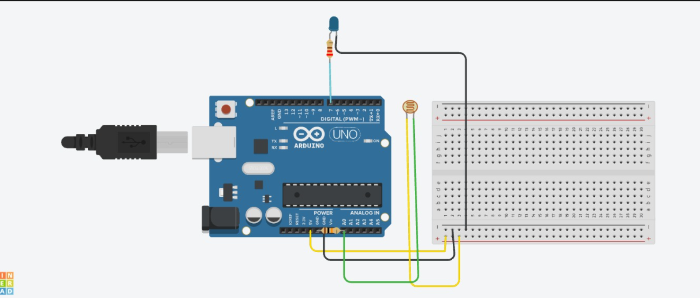

# LDR + LED — Light-Activated LED

**Sensor:** LDR (Light Dependent Resistor) on `A0`
**Actuator:** LED on Digital Pin `7`

## Description
Reads ambient light level via the LDR. When the light level drops below a threshold (dark), the LED turns ON; otherwise it stays OFF.

## Circuit

## Code
See [`ldr_led.ino`](ldr_led.ino)

## How it works
1. `analogRead(A0)` gives a value between 0–1023 based on light intensity.
2. If `sensorValue < 100` (dark), LED is switched `HIGH`.
3. Else LED is `LOW`.
4. Value is printed to Serial Monitor every 500 ms.
