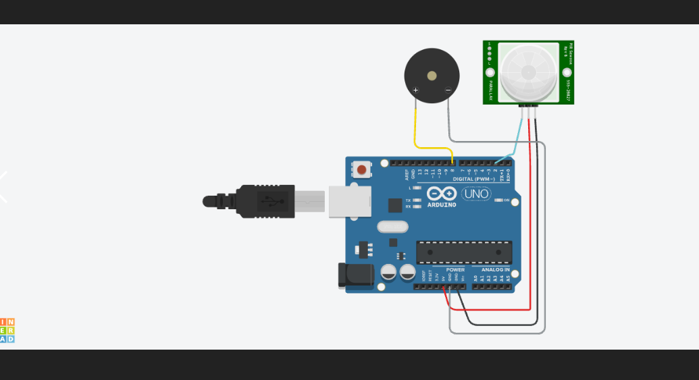

# PIR + Buzzer — Motion-Activated Alarm

**Sensor:** PIR Motion Sensor on Digital Pin `2`
**Actuator:** Buzzer on Digital Pin `8`

## Description
Detects motion using a PIR sensor. When motion is detected, the buzzer sounds; when no motion is present, it stays silent.

## Circuit

## Code
See [`pir_buzzer.ino`](pir_buzzer.ino)

## How it works
1. `digitalRead(2)` reads the PIR output (HIGH = motion detected).
2. If `HIGH`, buzzer is switched `HIGH` and "Motion Detected" is logged.
3. Else buzzer is `LOW` and "No Motion" is logged.
4. State is printed to Serial Monitor every 500 ms.
