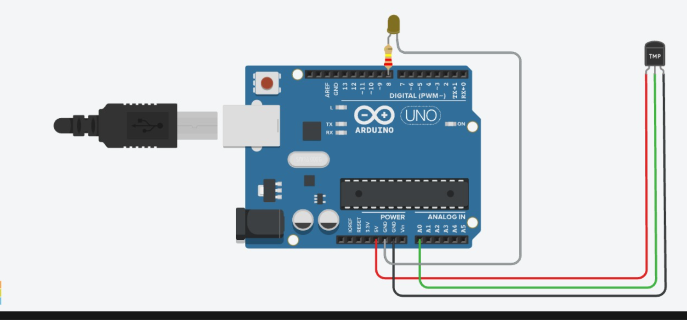

# TMP Sensor + LED — Temperature-Activated LED

**Sensor:** Analog Temperature Sensor (TMP36-type) on `A0`
**Actuator:** LED on Digital Pin `8`

## Description
Reads temperature via an analog temperature sensor and converts the raw voltage to degrees Celsius. If the temperature exceeds 30°C, the LED turns ON as a high-temperature indicator.

## Circuit

## Code
See [`temp_led.ino`](temp_led.ino)

## How it works
1. `analogRead(A0)` gives a raw value (0–1023).
2. Converted to voltage: `voltage = sensorValue * (5.0 / 1023.0)`.
3. Converted to °C: `temperature = (voltage - 0.5) * 100`.
4. If `temperature > 30`, LED is `HIGH` ("Temperature High"); else `LOW`.
5. Reading is printed to Serial Monitor every 1000 ms.
