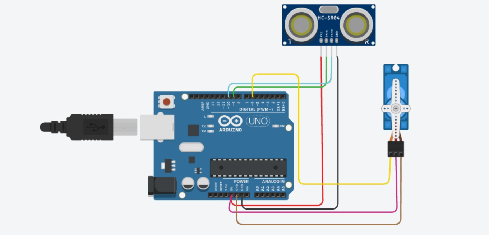

# Ultrasonic + Servo — Automatic Door

**Sensor:** HC-SR04 Ultrasonic Distance Sensor (Trig → Pin 9, Echo → Pin 10)
**Actuator:** Servo Motor on Pin `6`

## Description
Measures distance to the nearest object using the ultrasonic sensor. If an object (e.g. a person) comes within 30 cm, the servo rotates to 90° to open a "door"; otherwise it stays closed at 0°.

## Circuit

## Code
See [`ultrasonic_servo.ino`](ultrasonic_servo.ino)

## How it works
1. A trigger pulse (10 µs HIGH) is sent on `trigPin`.
2. `pulseIn(echoPin, HIGH)` measures the echo return time.
3. Distance is calculated: `distance = duration * 0.034 / 2` (cm).
4. If `distance < 30`, servo moves to `90°` ("Door Open").
5. Else servo returns to `0°` ("Door Closed").
6. Reading is printed to Serial Monitor every 500 ms.