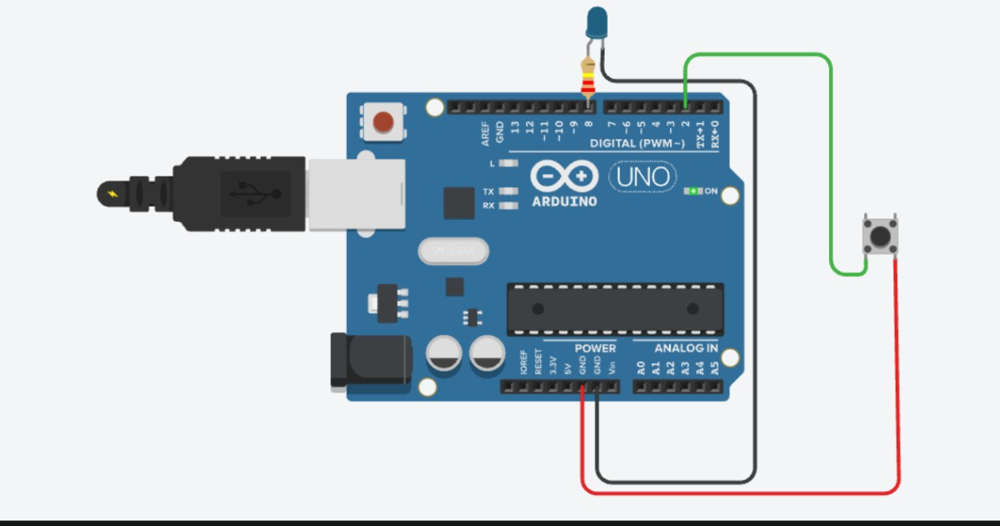

# Push Button + LED — Manual LED Toggle

**Sensor:** Push Button on Digital Pin `2` (using internal pull-up)
**Actuator:** LED on Digital Pin `8`

## Description
Reads the state of a push button. While the button is held down, the LED turns ON; when released, the LED turns OFF.

## Circuit

## Code
See [`pushbutton_led.ino`](pushbutton_led.ino)

## How it works
1. `buttonPin` is set to `INPUT_PULLUP`, so it reads `HIGH` when unpressed and `LOW` when pressed (button connects pin to GND).
2. `digitalRead(buttonPin) == LOW` means the button is pressed.
3. If pressed, LED is `HIGH` ("Button Pressed - LED ON").
4. Else LED is `LOW` ("Button Released - LED OFF").
5. State is printed to Serial Monitor every 200 ms.
