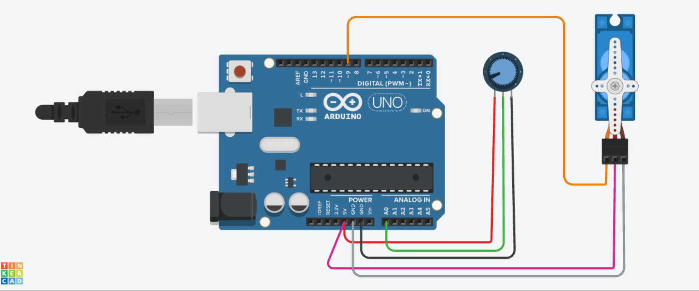

# Potentiometer + Servo — Manual Angle Control

**Sensor:** Potentiometer on `A0`
**Actuator:** Servo Motor on Digital Pin `9`

## Description
Reads the potentiometer's position and maps it to a servo angle (0°–180°), letting you manually control the servo's rotation by turning the dial.

## Circuit

## Code
See [`potentiometer_servo.ino`](potentiometer_servo.ino)

## How it works
1. `analogRead(A0)` gives a raw value (0–1023) based on potentiometer position.
2. `map(potValue, 0, 1023, 0, 180)` scales this to a servo-friendly angle.
3. `myServo.write(angle)` moves the servo to that angle.
4. Potentiometer value and resulting angle are printed to Serial Monitor every 15 ms.
