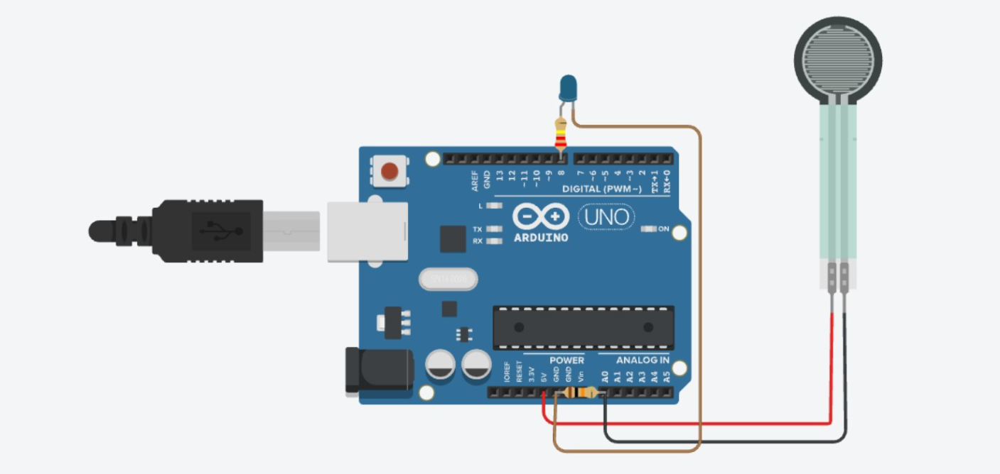

# FSR + LED — Pressure-Activated LED

**Sensor:** Force-Sensitive Resistor (FSR) on `A0`
**Actuator:** LED on Digital Pin `8`

## Description
Reads pressure applied to the FSR. When pressure exceeds a threshold, the LED turns ON; otherwise it stays OFF.

## Circuit

## Code
See [`fsr_led.ino`](fsr_led.ino)

## How it works
1. `analogRead(A0)` gives a value based on pressure applied to the FSR (higher pressure → lower resistance → higher reading, depending on wiring).
2. If `fsrValue > 100`, LED is `HIGH` ("Pressure Detected").
3. Else LED is `LOW` ("No Pressure").
4. Value is printed to Serial Monitor every 200 ms.
