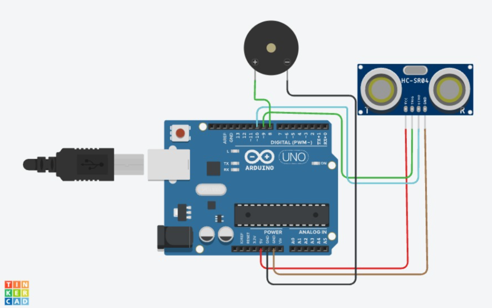

# Ultrasonic + Buzzer — Proximity Alert

**Sensor:** HC-SR04 Ultrasonic Distance Sensor (Trig → Pin 9, Echo → Pin 10)
**Actuator:** Buzzer on Digital Pin `8`

## Description
Measures distance to the nearest object. If something comes within 15 cm, the buzzer sounds as a proximity alert; otherwise it stays silent.

## Circuit

## Code
See [`ultrasonic_buzzer.ino`](ultrasonic_buzzer.ino)

## How it works
1. A trigger pulse (10 µs HIGH) is sent on `trigPin`.
2. `pulseIn(echoPin, HIGH)` measures the echo return time.
3. Distance is calculated: `distance = duration * 0.034 / 2` (cm).
4. If `distance < 15`, buzzer is `HIGH` ("Object Detected").
5. Else buzzer is `LOW` ("No Object Nearby").
6. Reading is printed to Serial Monitor every 500 ms.
