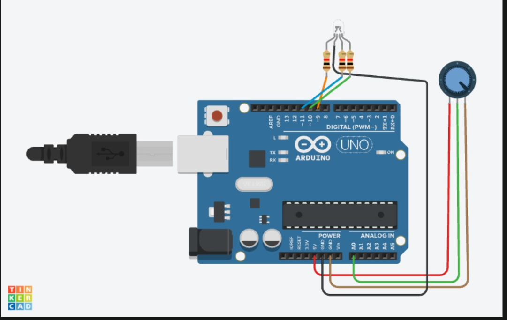

# Potentiometer + RGB LED — Brightness Dimmer

**Sensor:** Potentiometer on `A0`
**Actuator:** RGB LED on Digital Pins `9` (Red), `10` (Green), `11` (Blue)

## Description
Reads the potentiometer's position and maps it to a brightness level (0–255), driving all three channels of an RGB LED equally to dim it up and down like a white-light brightness knob.

## Circuit

## Code
See [`potentiometer_rgbled.ino`](potentiometer_rgbled.ino)

## How it works
1. `analogRead(A0)` gives a raw value (0–1023) based on potentiometer position.
2. `map(value, 0, 1023, 0, 255)` scales this to a PWM-friendly brightness value.
3. `analogWrite()` sets the same brightness on the red, green, and blue pins simultaneously.
4. Brightness value is printed to Serial Monitor every 20 ms.
