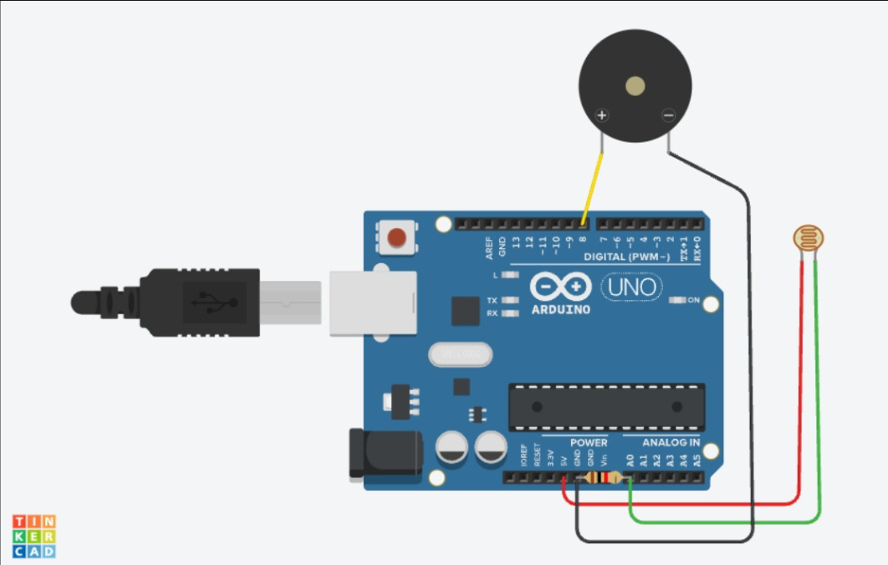

# LDR + Buzzer — Darkness Alarm

**Sensor:** LDR (Light Dependent Resistor) on `A0`
**Actuator:** Buzzer on Digital Pin `8`

## Description
Reads ambient light level via the LDR. When it gets dark (light level drops below a threshold), the buzzer sounds as an alarm; in bright conditions it stays silent.

## Circuit

## Code
See [`ldr_buzzer.ino`](ldr_buzzer.ino)

## How it works
1. `analogRead(A0)` gives a value between 0–1023 based on light intensity.
2. If `ldrValue < 300` (dark), buzzer is switched `HIGH` ("Dark - Buzzer ON").
3. Else buzzer is `LOW` ("Bright - Buzzer OFF").
4. Value is printed to Serial Monitor every 500 ms.
